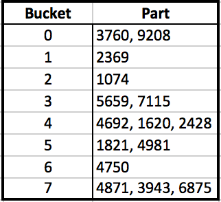

Databaser Øving 4 - Arve Nygård
===============================

Oppgave 1: Normaliseringsteori
------------------------------

### a) Definer følgende begreper: Nøkkel, supernøkkel og funksjonell avhengighet.
* __Nøkkel:__ Minimalt sett av attributter som gjør det mulig å unikt identifisere rader i tabellen.
* __Supernøkkel:__ Det samme som nøkkel, minus kravet om at settet skal være minimalt
* __Funksjonell avhengighet:__ I en relasjon R er Y funksjonelt avhengig av X (X → Y) hvis og bare hvis hver X-verdi er assosiert med 1 Y-verdi.

### b) Forklar hva menes med tillukningen (eng: closure), X+, til en mengde attributter, X, med hensyn til en mengde funksjonelle avhengigheter. Lag en algoritme for å finne X+. 

X+ er alle attributter som er funksjonelt bestemt av X mhp F.

```
X+ ← X
do
	temp ← X+
	for dependency x → y in F do
		if x ⊆ X+ then
			X+ ← X+ ∪ y 
while temp ≠ X+
```


### c) Gitt F = {a→e, ac→d, b→c}. Beregn følgende tillukninger (eng: Closure): a+, ab+, e+

- **a+:** ae
- **ab+:** abecd
- **e+:** e

### d) Hvordan avgjør man om en mengde attributter er en supernøkkel for en tabell? Hvordan avgjør man om en supernøkkel også er en nøkkel?

En mengde attributter er en supernøkkel for en tabell om alle attributtene som ikke er i mengden er funskjonelt avhengig av mengden. 
Dersom det ikke går an å fjerne et atributt fra supernøkkelen (uten at den slutter å være en supernøkkel), er den også en nøkkel.


### e) Hvordan avgjør man om en dekomponering av en tabell (R) i to projeksjoner (R1 og R2) har tapsløs-join-egenskapen? 

Dersom:
```
( R1 ∩ R2 ) → R1 eller ( R1 ∩ R2 ) → R2
```
Har oppdelingen i R1 og R2 tapløs-join-egenskapen.


### f) Gitt en tabell R(a, b, c, d) og funksjonelle avhengigheter F = {b→c}. Under er det vist tre dekomponeringer av R. Finn ut hvilke dekomponeringer som har tapsløs-join-egenskapen. I svaret må det gis en (kort) begrunnelse i hvert enkelt tilfelle. 
1. R1(a, b, c) og R2(b, c, d) - **NEI**  - R1∩R2 = (b,c) ≠ R1 || R2
2. R1(a, b, d) og R2(b, c, d) - **JA** - R1∩R2 = (b,d) = (b,c,d) = R2
3. R1(a, b, d) og R2(b, c) - **JA** - R1∩R2 = (b) => (b,c) = R2


### g) Gi en definisjon av tredje normalform (3NF). 
Ingen avhengigheter på attributter som ikke er nøkler.


### h) Tabellen R(A B C D) er ikke på 3NF når de funksjonelle avhengighetene som gjelder er F = {A → B, C → D}. En mulig dekomponering av R er R1(A B), R2(C D) og R3(A C). Er denne dekomponeringen en god løsning? Svaret må begrunnes.


##### .
Oppgave 2: 16.31 Statisk hashing 
--------------------------------
**En hashfil PARTS med feltet Part# som nøkkel inneholder poster med de følgende nøklene: 2369, 3760, 4692, 4871, 5659, 1821, 1074, 7115, 1620, 2428, 3943, 4750, 6975, 4981 og 9208. Fila har 8 blokker, nummerert 0—7. Hver blokk kan inneholde to poster. Sett inn postene i fila i den rekkefølgen de er gitt, og bruk hashfunksjonen h(K) = K MOD 8. Beregn gjennomsnittlig antall blokkaksesser når man aksesserer fila ved tilfeldig aksess via Part#.**



Siden hver bucket kun kan inneholde 2 records, får vi overflow. Her kan vi bruke overflow-chaining.

Average block accesses:  
`15` totale parts.  
`13` av disse krever én block access.  
`2` av disse krever to block accesses.  
  
`13/15 + 2*2/15 = 17/15` block accesses on average

##### .
Oppgave 3: 16.32 Extendible hashing 
-----------------------------------
**Sett inn postene fra oppgave 2 (16.31) i en hashfil basert på extendible hashing. Vis strukturen for katalogen etter hver innsetting og vis både global og lokal dybde. Bruk hashfunksjonen h(K) = K MOD 128. Start med global dybde 2 og fire blokker. Hver blokk kan inneholde 2 poster.**


Sett inn postene i en hashfil basert på extendible hashing. Vis strukturen for katalogen etter hver innsetting og vis både global og lokal dybde. Bruk hashfunksjonen h(K) = K MOD 128. Start med global dybde 2 og fire blokker. Hver blokk kan inneholde 2 poster.


først hasher vi:
```
-------------------------
| Part  h(K)   h(K)base2|
-------------------------
|2369 |  65  | 1000001  |
|3760 |  48  | 0110000  |
|4692 |  84  | 1010100  |
|4871 |  7   | 0000111  |
|5659 |  27  | 0011011  |
|1821 |  29  | 0011101  |
|1074 |  50  | 0110010  |
|7115 |  75  | 1001011  |
|1620 |  84  | 1010100  |
|2428 |  124 | 1111100  |
|3943 |  103 | 1100111  |
|4750 |  14  | 0001110  |
|6975 |  63  | 0111111  |
|4981 |  117 | 1110101  |
|9208 |  102 | 1111000  |
```

Så mekker vi en extendable hashing fil:
```
|Bucket | Parts                  |
|00     | 4871, 5659, 1821, 4750 |
|01     | 3760, 1074, 6975       |
|10     | 2369, 4692, 7115, 1620 |
|11     | 2428, 3943, 4981, 9208 |

>> Overflow in buckets 00, 01, 10, 11.
>> Split 00, 01, 10, 11.
>> Spliting bucket with local depth = global depth.
>> Increase global depth

| Bucket | d' |  Parts              |
|000     | 3  | 4871, 4750          |
|001     | 3  | 5659, 1821          |
|010     | 3  |                     |
|011     | 3  | 3760, 1074, 6975	|
|100     | 3  | 2369, 7115			|
|101     | 3  | 4692, 1620			|
|110     | 3  | 3943				|
|111     | 3  | 2428, 4981, 9208	|

>> Overflow in buckets 011, 111.
>> Split 011, 111.
>> Spliting bucket with local depth = global depth.
>> Increase global depth


>>  * indicates pointing to same bucket as above.
| Bucket  | d' |  Parts              |
|0000     | 3  | 4871, 4750         |
|0001     | *  | *		          	|
|0010     | 3  | 5659, 1821         |
|0011     | *  | *			        |
|0100     | 3  |                    |
|0101     | *  | *                  |
|0110     | 3  | 3760, 1074, 6975	|
|0111     | 3  | 3760, 1074, 6975	|
|1000     | 3  | 2369, 7115			|
|1001     | *  | *					|
|1010     | 3  | 4692, 1620			|
|1011     | *  | *					|
|1100     | 3  | 3943				|
|1101     | *  | *					|
|1110     | 3  | 2428, 4981, 9208	|
|1111     | 3  | 2428, 4981, 9208	|


```

##### .
Oppgave 4: 16.33 Lineær hashing 
-------------------------------
**Sett inn postene fra oppgave 2 (16.31) i en hashfil med lineær hashing. Start med ei blokk og bruk hashfunksjonen h0 = K MOD 20, og vis hvordan fila vokser og hvordan hashfunksjonen endrer seg. Anta blokkene splittes hver gang ei overflytsblokk lages. Vis N etter hver innsetting.**


##### .
Oppgave 5: B+-trær 
------------------
### a) Vi skal lage en B+-tre-indeks for en studentdatabase med 300000 studenter. Primærnøkkelen for en student er studentnummer, et heltall som trenger 4 bytes representasjon. Anta en blokkidentifikator til å være 4 bytes. På løvnivå i B+-treet er det for hver studentpost en peker til blokka hvor studentposten lagres. Anta ei blokk til å være 4096 bytes. Hvor mange blokker vil det være på de forskjellige nivåene i B+-treet? Forklar eventuelle antagelser du tar. 

### b) Hvis du setter inn student nummer 300001 i studentdatabasen, hvor mange diskaksesser får du? Forklar eventuelle antagelser du tar. 
### c) Hvis du skal søke etter og oppdatere en post på løvnivå i B+-treet, hvor lang tid tar det? Anta fornuftige diskaksesstider og forklar eventuelle andre antagelser du tar. 
### d) Anta det er plass til 3 poster per blokk i et B+-tre. Anta at B+-treet er tomt når du starter. Vis B+-treet etter at du har satt inn de følgende nøklene: 12, 9, 3, 18, 22, 1, 37, 11. 