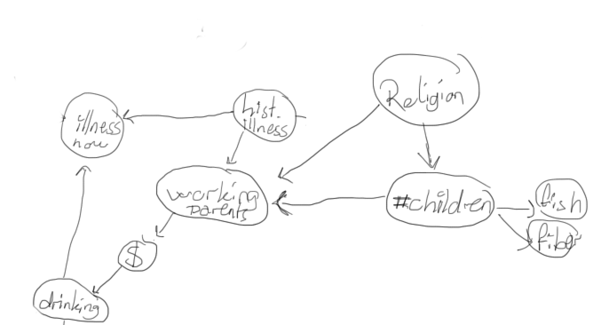
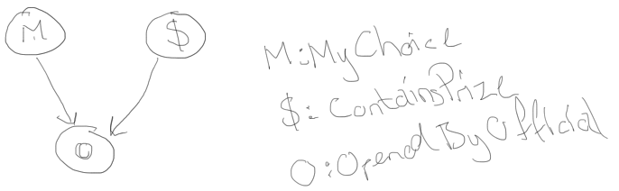

% TDT4171 AI2 Exercise 1
% Arve Nygård
% 29.01.13

1. 5-card poker hands
=====================

## a) How many atomic events are there in the joint probability distribution (i.e.,how many 5-card hands are there)?

There are $52*51*50*49*48 = 311 875 200$ different hands.

## b) What is the probability of each atomic event?
 $\dfrac{1}{311 875 200}$

## c) What is the probability of being dealt a royal straight flush? Four of a kind?

### Royal straight flush:  
Four possibilities, one per suit.  

$\dfrac{4}{52*51*50*49*48} = \dfrac{1}{52*51*50*49*12} = \dfrac{1}{77968800}$
 
### Four of a kind:  
The four of a kind can take on 13 different values. The wildcard for each value then has $52-4 = 48$ different possibilities:  
  
$\dfrac{13*48}{52*51*50*49*48} = \dfrac{1}{4*51*50*49} = \dfrac{1}{499800}$

\pagebreak

2. Bayesian Network
===================

Conditional independence properties of the network
--------------------------------------------------

The following variables are conditionally independent given my network: 

  * Fish eaten / Fiber eaten, given number of children
  * Illness now / Working parents, given history of illness.

I think these are reasonable.

\pagebreak

3. Monty Hall
=============

| m | P(m) | ,  | $ | P($) |
|:-:|:----:|:-:|:-:|:-----:|
|	1 |	1/3  | ,  | 1 | 1/3  |
|	2 |	1/3  | ,  | 2 | 1/3  |
|	3 |	1/3  | ,  | 3 | 1/3  |

Table: Base probabilities for MyChoice and ContainsPrice.

Row| $ | M | P(o=1) | P(o=2) | P(o=3) |
:--|:-:|:-:|:------:|:------:|:------:|
1. | 1 | 1 |   0    |  0.5   |  0.5   |
2. | 1 | 2 |   0    |   0    |   1    |
3. | 1 | 3 |   0    |   1    |   0    |
4. | 2 | 1 |   0    |   0    |   1    |
5. | 2 | 2 |  0.5	  |   0    |  0.5   |
6. | 2 | 3 |   1    |   0    |   0    |
7. | 3 | 1 |   0    |   1    |   0    |
8. | 3 | 2 |   1    |   0    |   0    |
9. | 3 | 3 |  0.5	  |	 0.5   | 	 0    |

 Table: Probabilities for OpenedByOfficial, given MyChoice and ContainsPrice

\pagebreak

Argument and Conclusion
-----------------------

There are two "start situations"; MyChoice = ContainsPrice (with a probability of $\frac{1}{3}$), and MyChoice != ContainsPrice (with a probability of $\frac{2}{3}$).
For each of these, there are two choices to make after the Official has opened his door: Keep MyChoice, or change MyChoice to the last door. Let's investigate each of these situations.

### 1) `M = $`, _don't switch door_
Rows 1, 5 and 9 satisfies `M = $`. Out of these, we see that this strategy wins every time.

### 2) `M != $`, _don't switch door_
Rows 2, 3, 4, 6, 7, 8 satisfies `M != $`. If we don't switch doors in this situation, we lose.

Note that under the _Don't switch_ strategy, we win $\frac{3}{9} = \frac{1}{3}$ of the time.

### 3) `M = $`, _switch door_. 
Rows 1, 5, 9 again. We lose in all of these 3 situations.

### 4) `M != $`, _switch door_
Rows 2, 3, 4, 6, 7, 8. We see from the table that Monty has opened the empty door (P=1), so switching wins us the price in all of these cases.
  
By playing the _switch door_ strategy, we obtain a $\frac{2}{3}$ chance of winning!
Thus, **We should always switch doors**.

