% TDT4171 - Artificial Intelligence Methods, assignment 3
% Arve Nygård, Espen Larssen
% 05.02.2014

Introduction
============

In this exercise, we have chosen to make a decision support system made to help with vacation planning. To broaden the utulity of the system, we have included three different decisions, each for which we will provide a use-case and result.

This document roughly follows the steps outlined in the slides for the assignment.

Step 0 - Decide what to model
=============================
We want to model three related decisions regarding vacations.

Step 1a - Defining variables
============================

Evidence variables
------------------

* Ticket Price: [1k-3k, 3k-6k, 6k-9k, 9k-12k]
* Travel time: [1-3h, 3-6h, 6-9h, 9-12h]

Uncertain Variables
-------------------

* Weather [Dry, Wet]
* Climate [Freezing, Cold, Temperate, Hot]
* Will the persons i meet speak English? [Yes/No]
* Will I get sick? [Yes/No]
* Will I get robbed? [Yes/No]
* Earthquake [Yes/No]
* Hotel quality [Good, Shitty]

\pagebreak

Step 1b - Defining decisions
============================

We include the following three decisions in our system:

Where should we travel?
-----------------------

- San Fransisco
- Sao Paulo
- Åre
- Oslo
- Paris
- Bangkok

When should we travel?
----------------------

- January
- April
- July
- October

What kind of vacation do we want?
---------------------------------

- Sunbathing
- Skiing

Use cases
---------
Following are some examples of questions our system can answer.

### Where should we travel?
  This is the most frequent use-case in our experience. Normally you are in a situation where you know what kind of vacation you want, and you know when your vacation weeks are up front. Discussions tend to center around where to travel given these two constraints, combinded with constraints in budget and perhaps travel time (for a short vacation you might not want to spend 20h on a plane each way).

### When should we travel?
  Some people (such as students) are more free to choose when they want to take their vacation time. A use case for such a person might be that s/he has decided where to travel and what to do there, but wants to know when would be the best time to go there.

### Vacation type
  If you have the tickets ready, but are unsure on how to pack, you can constrain the system to location and date, and it will let you know what would most likely be the best way to pack your bags.

Step 2 - The qualitative part
=============================
The relations between the varaibles we chose to include in our model are visualized in [fig. 1].

Part of the reason for including more than one decision is that the model ended up being very  "shallow" - meaning every random variable is only influenced directly by one or more decision variables, and not any other random variable. We fear that this might be missing part of the point of the assignment (Bayesian), but we found no more reasonable way of modeling the decision influences in this scenario.

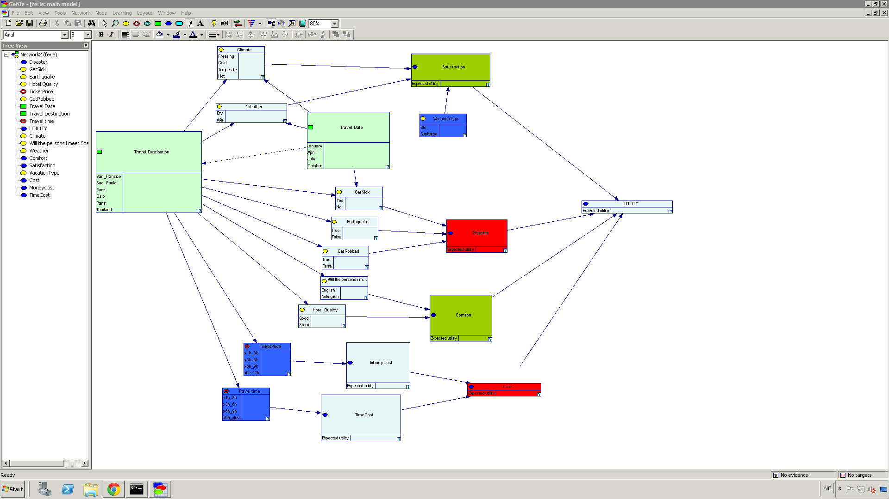

Most of these variables are obviously conditionally independent given `location`.
`(Weather, Climate)` is cond.indep. given `(location, travel date)`.

Step 3a - The quantitive part
=============================
Determining probabilities and later utility points was definitely the harest part of the assgnment.

We ended up using a combination of gut feeling and numbers off the internet (e.g. to get a realistic seasonal variation for weather or temperature).

Probability tables for the a selection of the variables follow on the next page.

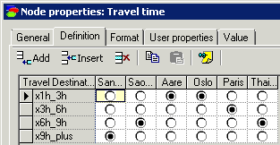

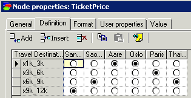

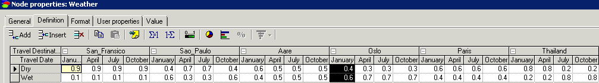

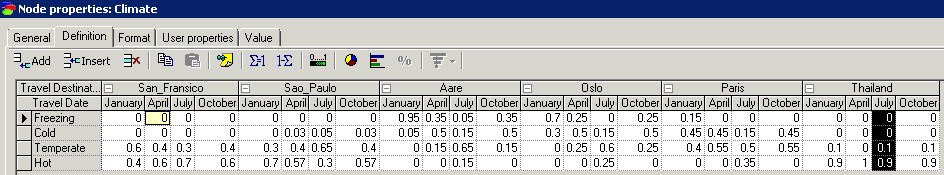

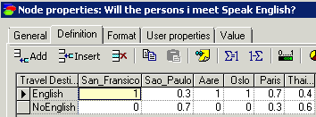

Step 3b - Utility Function
==========================

Due to the "shallow" nature of our model, we end up with a pretty complicated utility function.
To alleviate this, we use multiple utility functions, which we then connect to a MAU node, assigning weights to each utility node. This makes the process of defining utility scores more intuitive (for us) - it is easier to decide the relative weight of each utility function in the MAU node, than it would have been to decide simultaneously on the relative weight of each combination of properties in a single Utility Node.

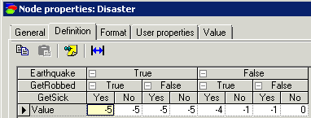

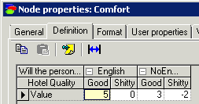

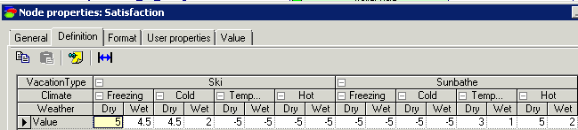

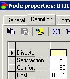

\pagebreak

Step 4 - Verification
=====================

We test our model using a few test cases in which the answer is obvious to us. We hope to observe a result that we agree with.

Test case 1:  Where to ski
--------------------------

We have a weeks vacation in january, and we want to do some skiing. Where should we travel?

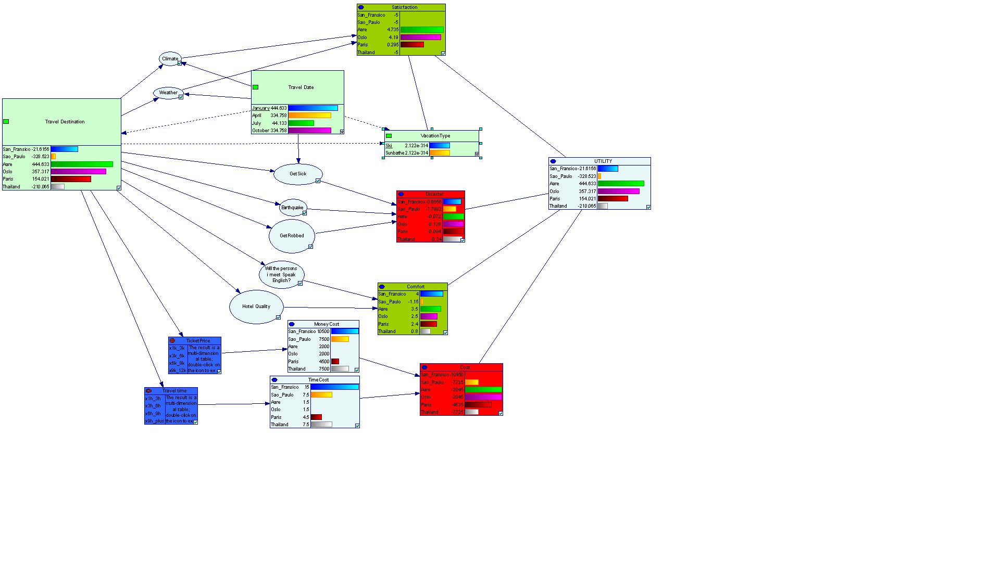

Åre is the obvious winner here.

\pagebreak

Test case 2: When to travel?
----------------------------

We decided to take a trip to Thailand for some sunbathing. We want to avoid the rain season. Which month should we take out our vacation weeks?

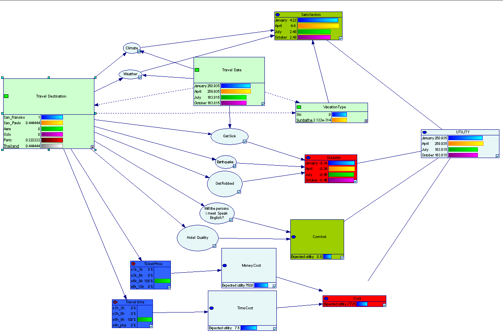

Test case 3: What to pack
--------------------------

We won a surprise ticket to Oslo. The ticket is in July. Should you pack skis or bikini?

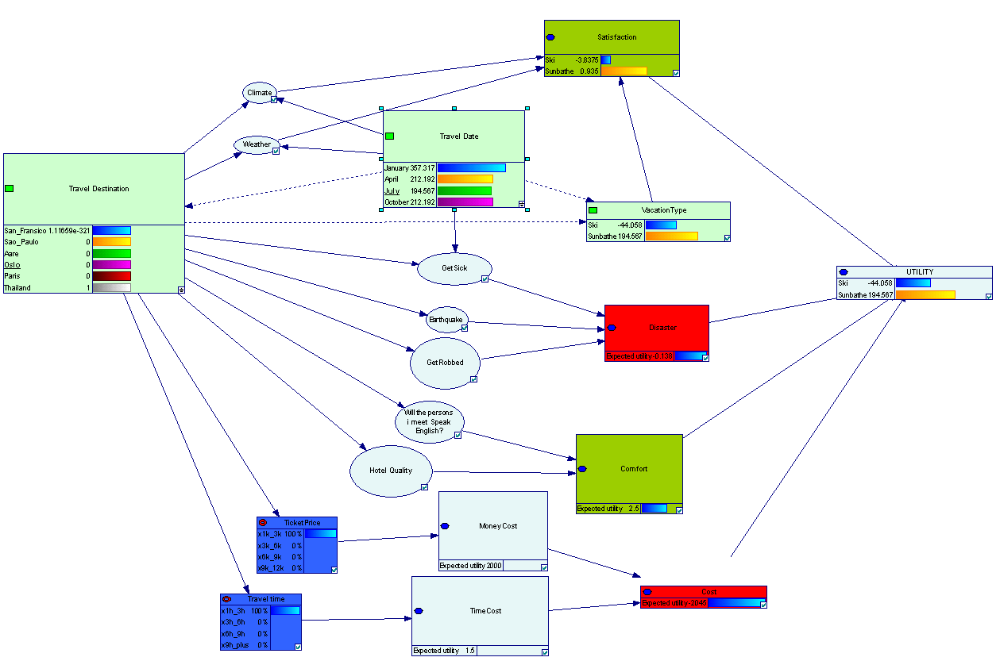

(While playing around, we notice that any other quarter of the year, packing your skis is a better idea.)
