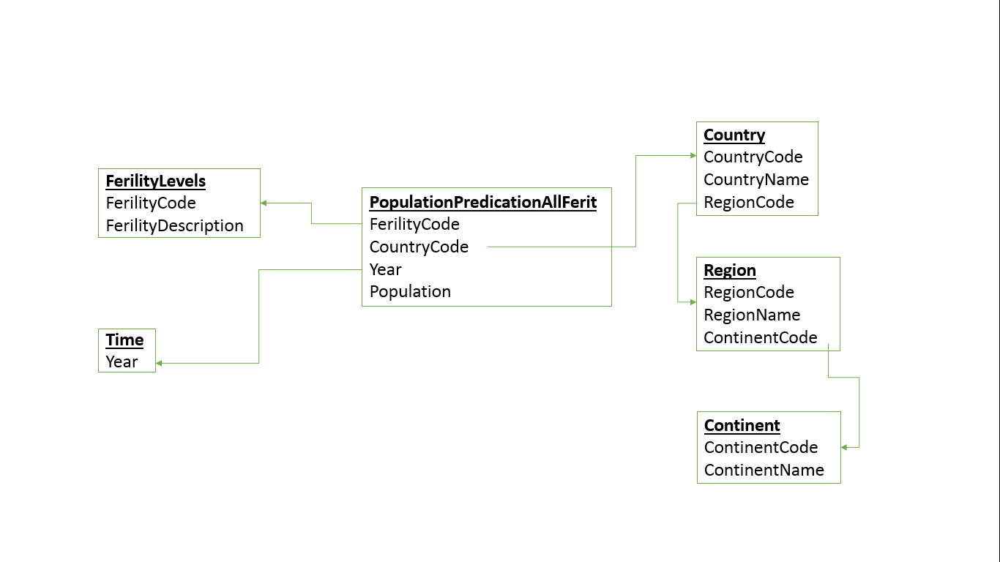
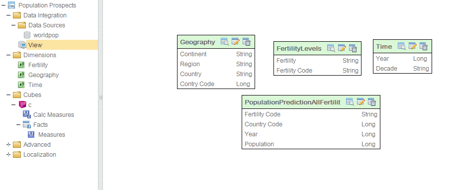
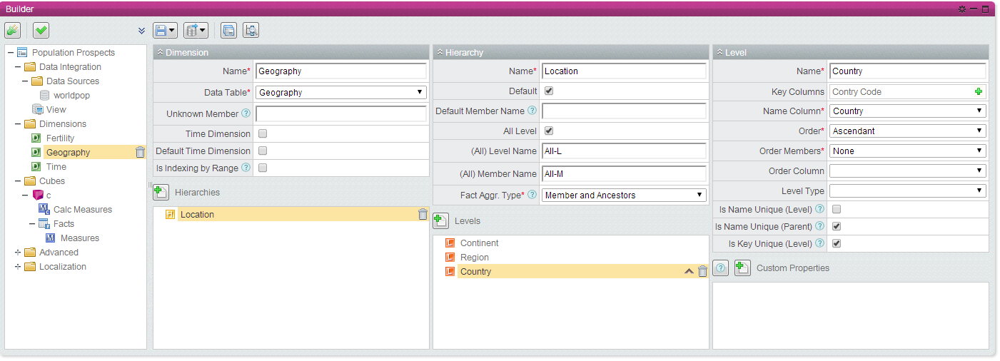
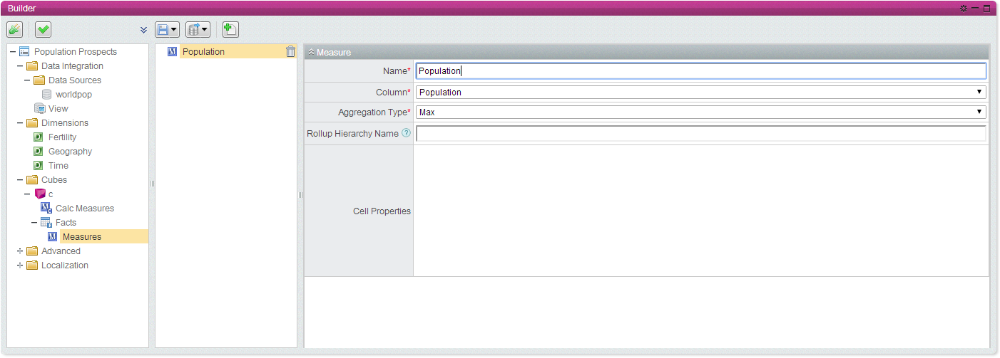
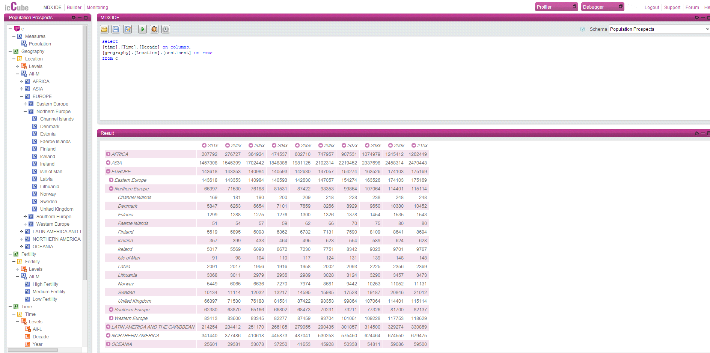
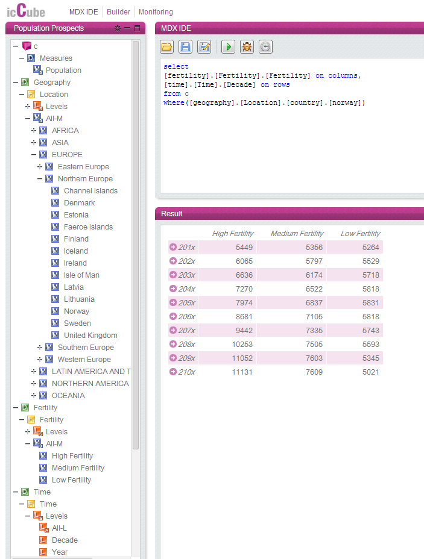

% TDT4300 Assignment 1
% Arve Nygård; Tobias Linkjendal
% 07.02.2014

Exercise 1
==========

1. a) Explain the concepts of OLTP and OLAP
-------------------------------------------

OLTP, **O**nline **T**ransaction **P**rocessing, is the process of many short online transactions like `INSERT`, `DELETE`, and `UPDATE`. It is important that the query processing is fast and that the data integrity is maintained in multi-access environments. The systems effectiveness is measured by the number of transactions per second.
OLAP, **O**nline **A**nalytical **P**rocessing, is handling fewer transactions than OLTP, as the queries are often very complex. The data has been analyzed and aggregated, and can tell a history. This historical data is stored in multi-dimensional schemas, like for example a star schema.
The main differences between the two concepts are that OLTP focuses on operations and having detailed and current data, while OLAP focuses on the information extracted from data by analyzing it.
 

1. b) Explain the concept of data cube and the meaning of the term "cuboids".
-----------------------------------------------------------------------------

A data cube is a multi-dimensional array of values. A data cube can be used to generate cuboids consisting of a subset of the data cube's dimensions
 

c. Explain the data cube operations slice, dice, rollup and drill-down
-----------------------------------------------------------------------

- **Slice:** Picking a specific value for one of the dimensions, getting a “slice” of the cube.
- **Dice:** Picking specific values for multiple dimensions, getting a sub-cube that has been “diced”.
- **Roll-up:** Viewing data in less detail, for example looking on decades instead of years. “Walking up the hierarchy”
- **Drill-down:** Viewing data in more detail, for example looking on years instead of decades. “Walking down the hierarchy”

Exercise 2 (alternative b)
==========================

2. a) Make a case description for the chosen dataset where you explain what facts and dimensions you find interesting.
----------------------------------------------------------------------------------------------------------------------

We have used the provided “World population prospects” data set.
This data set shows how the population in different countries will change with time, depending on the countries' fertility levels. It is interesting how we can see the population will change, and we can use this data to predict which countries and regions that will have huge or low population. 

\pagebreak

b) Make a star or snowflake schema for this case description.
-------------------------------------------------------------

c) Define two different concept hierarchies (freely chosen dimensions)
----------------------------------------------------------------------

**Geography**: Continent > Region > Country
**Time**: Decade > Year

\pagebreak

3. Document your work e.g. by taking screenshots from the builder and med editor
================================================================================

