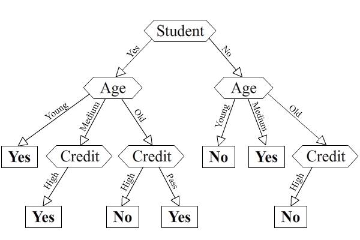

% Data mining Assignment 3
% Tobias Linkjendal, Arve Nygård
% 16.03.2014

\pagebreak

1. Decision Trees
=================

1.1 GINI for whole set
---------------------
Yes: $12$
No : $8$
Total entires: $20$

GINI = $1 - \left[ \left(\dfrac{12}{20}\right)^2 + \left(\dfrac{8}{20}\right)^2\right] = 0.48$

1.2 GINI for UserID
------------------

GINI = $20 * \dfrac{1}{20} \left[1 - \left(\dfrac{0}{1}\right)^2 - \left(\dfrac{1}{1}\right)^2 \right] = 0$

1.3. GINI for Age
---------------

###Age: Young
Yes: 4  
No:  3  
Total: 7

GINI(Young) = $1 - \left[\left(\dfrac{4}{7}\right)^2 + \left(\dfrac{3}{7}\right)^2\right] = 0.49 $

###Age: Medium
Yes: 5  
No:  1  
Total: 6

GINI(Medium) = $1 - \left[\left(\dfrac{5}{6}\right)^2 + \left(\dfrac{1}{6}\right)^2\right] = 0.28$

###Age: Old
Yes: 3  
No:  4  
Total: 7

GINI(Old) = $1 - \left[\left(\dfrac{3}{7}\right)^2 + \left(\dfrac{4}{7}\right)^2\right] = 0.49$

### Age: Total

GINI(Age) = $\dfrac{7}{20} * GINI(Young) + \dfrac{6}{20} * GINI(Medium) + \dfrac{7}{20} * GINI(Old)$  

GINI(Age) = $\dfrac{7}{20} * 0.49 + \dfrac{6}{20} * 0.28 + \dfrac{7}{20} * 0.49  = 0.43 $

\pagebreak

1.4. GINI for Student
-------------------

### Student: Yes
Yes: 8
No: 2
Total: 10
GINI(Student:Yes) = $1 - \left[\left(\dfrac{8}{10}\right)^2 + \left(\dfrac{2}{10}\right)^2\right] = 0.32 $

### Student: No
Yes: 4
No: 6
Total: 10
$0.4$
GINI(Student:Yes) = $1 - \left[\left(\dfrac{8}{10}\right)^2 + \left(\dfrac{2}{10}\right)^2\right] = 0.48 $

### Student: Total
GINI(Age) = $\dfrac{10}{20} * GINI(Student:Yes) + \dfrac{10}{20} * GINI(Student:NO)$  

GINI(Age) = $\dfrac{10}{20} * 0.32 + \dfrac{10}{20} * 0.28 + \dfrac{10}{20} * 0.48  = 0.4 $

1.5. GINI for Creditworthiness
----------------------------

### Creditworthiness: High, Creditworthiness: Pass

Yes: 4  
No:  6  
Total: 10  

GINI(Cred:High) = GINI(Cred: Pass) = GINI(Creditworthiness) =  
$1 - \left[\left(\dfrac{6}{4}\right)^2 + \left(\dfrac{6}{4}\right)^2\right] = 0.48$

1.6. Which attribute is best?
---------------------------

`UserId` has the best GINI-score. This is self-evident because each new customer gets a distinct id. New visitors would never get an old UserId. The interpretation here is that _all customers with `UserId = 1` buys a computer. This is always true. However, the attribute has no predictive power because as we said, every new customer gets a unique id. If we want to predict wether a specific (returning) customer will buy a new computer, then this would be a good attribute, but we would need more than one data point per customer in the training set. In conclusion: We should ignore the `UserId` attribute.

This leaves **Student** as the best attribute (lowest GINI score).

\pagebreak

1.7: User 21: A young student with medium income and "high" creditworthiness
----------------------------------------------------------------------------

Student: Yes -> Age: Young -> Prediction: **Will buy computer**

1.8: User 22: A young non-student with low income and "pass" creditworthiness
-----------------------------------------------------------------------------

Student: No -> Age: Young -> Prediction: **Will not buy a computer**

\pagebreak

2.2 Datasets
============

We assume that spam is the most difficult to classify, because nobody has really solved this huge problem in the real world yet.

If we are tossing away any such domain knowledge, then Iris would probably be the most difficult to classify because it has the fewest instances (examples) to train with, and also it has a relatively high `variable / instance` ratio.

|             | Iris | Diabetes | Spambase |
|-------------+------+----------+----------|
| Variables   |  4   |    8     |   57     |
| Instances   | 150  |   768    |  4601    |

  : Variable and instance count in each data set.

2.3 Classification
==================

J48
---

Diabetes dataset: With the default values, we got 73.8% accuracy. Increasing the confidenceFactor to 0.5 and minNumFolds to 20, we get a better accuracy with 75,1%.
Iris dataset: With the default values, we got 96% accuracy. We were not able to get higher accuracy, but increasing the minNumObj decreased the accuracy.
Spambase dataset: With the default values, we almost got 93% accuracy. We were able to get 93,2% accuracy by decreasing the minNumObj to 1.

KNN
---

Diabetes dataset: With the default values, we got 72,8% accuracy. Setting the KNN=2 gave a better accuracy of 74,7%, while only KNN=5 gave a better accuracy of 75,1%. We got our highest accuracy of 77% when we set the WindowSize=5 and KNN=2.
Iris dataset: With the default values, we got 96% accuracy. Tweaking the WindowSize gave different results, but we had a best accuracy of 98% when WindowSize was around 50. Increasing the KNN did not give better output for this dataset.
Spambase dataset: With the default values, we got 89% accuracy. Increasing the KNN to 5 gave us a slightly better accuracy of 89,3%. Having a WindowSize that was not the default value did not give better results, but it was better to have a higher WindowSize than a lower one.

Support vector machines
-----------------------

Diabetes dataset: With the default values, we got 79,3% accuracy. We got our best accuracy of 80% with epsilon=10^-8. The other values decreased or did not affect the accuracy.
Iris dataset: With the default values, we got 96% accuracy. We were not able to get a better accuracy than this, and increasing the epsilon value decreased the accuracy.
Spambase dataset: With the default values, we got 90,5% accuracy. We got better accuracy by increasing the epsilon value to 10^-8 and 10^-1, which respectively gave 91,75% and 92,6% accuracy. We did not manage to get better accuracy by changing the other values.

2.4 Evaluation
==============

To do cross-validation you partition the data into k disjoint partitions. You do the training on k-1 partitions, and test on the remaining one. This can be repeated k times with different test-partitions, and will guard against type III errors. This is important when it is impossible to collect further samples, or if the samples are hazardous and/or costly.
If the instances are ordered by classes as described in the exercise, we would only have done training on the two first classes. Therefore it would not be reasonable to perform a percentage split of 66% there. We want to train on all the classes to get the best classifier.

2.5 Best Classifiers
====================

According to our results, the support vector machines reported the best results overall, but J48 was right behind with a better result for the `spambase` data set. With some more tweaking on the support vector machines we could probably get a better result on `spambase`. k-NN did a really good job with the Iris data set, and had the highest accuracy for this data set. The results for the other data sets were not quite as good.
We tried some of the other classifiers with the `spambase` dataset, which is the dataset we expected to be most difficult and the two top classifiers above had quite similar accuracy. We found one that gave a surprisingly good result under trees; RandomForest. We set  `numTrees=50` and `seeds=10`, which gave a 95,2% accuracy -  which is quite a lot better than the other classifiers from this exercise.
