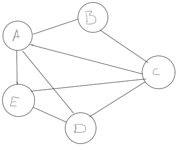
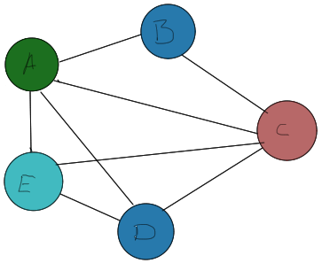

% Compilers, assignment 6 theory
% Arve Nygård
% 25.03.2014

Problem 1, Optimization
=======================

Original flow graph:
--------------------

```IR
--------------------
B1: i = 1
--------------------
B2: if i > b GOTO B4
--------------------
B3: t = a * c
    i = i + t
    j = i
    d = 0
    d = j + 2
    e = i + t
    f = f * e
	GOTO B2
--------------------
B4:
--------------------
```


1.a) Common subexpression elimination
--------------------------------------
If the same expression is computed multiple times, reuse it. Saves computation.

```IR
--------------------
B1: i = 1
--------------------
B2: if i > b GOTO B4
--------------------
B3: t = a * c
    i = i + t
    j = i
    d = 0
    d = j + 2
    e = i + t       ; Can't eliminate because i was reassigned
    f = f * e
	GOTO B2
--------------------
B4:
--------------------
```


1.b) Copy Propagation
---------------------
After assignment x = y, replace uses of x with y. Replace until x is assigned again. Helps with register allocation.

```IR
--------------------
B1: i = 1
--------------------
B2: if i > b GOTO B4
--------------------
B3: t = a * c
    i = i + t
    j = i
    d = 0
    d = i + 2   ; Copy Propagation
    e = i + t
    f = f * e
	GOTO B2
--------------------
B4:
--------------------
```

1.c) Code Motion
----------------
Hoist static computations outside of loops (must have no externally visible side-effects). Saves computation.

```IR
--------------------
B1: i = 1
--------------------
B2: t = a * c   ; Code Motion
    d = 0       ; Code Motion
    if i > b GOTO B4
--------------------
B3: i = i + t
    j = i
    d = j + 2
    e = i + t
    f = f * e
	GOTO B2
--------------------
B4:
--------------------
```
\pagebreak

1.d) Dead Code elimination
---------------------------
If effect of a statement is never observed, eliminate the statement. Saves computation, space.

```IR
--------------------
B1: i = 1
--------------------
B2: if i > b GOTO B4
--------------------
B3: t = a * c
    i = i + t
    j = i
	d = j + 2    ; Removed d = 0.
    e = i + t
    f = f * e
	GOTO B2
--------------------
B4:
--------------------
```
_(This task is interpreted as a local optimization pass. If this was the complete code, a lot more code could have been removed.)_
\pagebreak


Problem 2, Optimization
=======================
Consider the following c code:

```c
for(int i = 0; i < n; i++){
	sum = 4 * i;
	for(int j = 0; j < m; j = j + i){
		a = a + b * 2;
	}
}
```

2.a) What is an induction variable, and what is reduction in strength?
-------------------------------------------------------------------

**Induction variable:** A loop variable whose value depends linearly on the iteration number

**Strength reduction** Replace expensive operations (multiplication, division) by cheap ones (addition, subtraction, shifts)

2.b) Convert the code to a three-address flow graph
---------------------------------------------------


**Notice:** _Provided code contains infinite loop :(_

```IR
B1: int i = -1
-----------------------
B2: i = i+1
    if i >= n GOTO B6
-----------------------
B3: sum = 4 * i
    int j = -i
-----------------------
B4: j = j + i
    if j >= m GOTO B2
-----------------------
B5: int _bb = b * 2
    a = a + _bb
    GOTO B4
-----------------------
B6:
-----------------------
```
\pagebreak


2.c) Optimize the flow graph using strength reduction and induction variable elimination
----------------------------------------------------------------------------------------


### 2.c.i) Strength Reduction

```IR
B1: int i = -1
    int sum = 0
-----------------------
B2: i = i+1
    if i >= n GOTO B6
-----------------------
B3: sum = sum + 4
    int j = -i
-----------------------
B4: j = j + i
    if j >= m GOTO B2
-----------------------
B5: _bb = b + b
    a = a + _bb
    GOTO B4
-----------------------
B6:
-----------------------
```

### 2.c.ii) Induction Variable Elimination

_Plan of attack, in c:_

```C
int _a = a; // Intitial value for a
for(; a < (_a + (b*2*m)/i); a = a + b * 2){
}
```

_IR Code:_

```IR
B1: int i = -1
    int sum = 0
    int _bb = b + b // code motion :D
-----------------------
B2: i = i+1
    if i >= n GOTO B6
-----------------------
B3: sum = sum + 4
    int _condition = _bb * m
    _condition = _condition / i
    _condition = _condition + a

-----------------------
B4: if a >= _condition GOTO B2
-----------------------
B5: a = a + _bb
    GOTO B4
-----------------------
B6:
-----------------------
```


Problem 3
=========

3.a) What does it mean for a definition to reach a pint in the code?
--------------------------------------------------------------------

The definition is observable at that point in the code.


3.b) Perform reaching definition analysis
-----------------------------------------

|   B   |       IN                         |   kill    |   gen        |    OUT                         |
|-------|----------------------------------+-----------+--------------+--------------------------------|
|   B1  |        {}                        |           | {d1, d2, d3} | {d1, d2, d3}                   |
|   B2  | {d1, d2, d3}                     | {d1}      | {d4, d5}     | {d2, d4, d5}                   |
|   B3  | {d2, d3, d4, d5}                 | {d2}      | {d6, d7}     | {d4, d5, d6, d7}               |
|   B4  | {d2, d4, d4, d5}                 | {d2}      | {d8, d9}     | {d4, d5, d8, d9}               |
|   B5  | {d3 d4, d5, d6, d7, d8, d9}      | {d3, {d5} | {d10, d12}   | {d4, d6, d7, d8, d9, d10, d12} |

  : Reaching definition analysis -  Iteration 1

|   B   |       IN                                  |   kill    |   gen        |    OUT                                      |
|-------|-------------------------------------------+-----------+--------------+---------------------------------------------|
|   B1  |{d4, d6, d7, d8, d9}, d10, d12}            |           | {d1, d2, d3} | {d1, d2, d3, d4, d6, d7, d8, d9, d10, d12} |
|   B2  |{d1, d2, d3, d4, d6, d7, d8, d9, d10, d12} | {d1}      | {d4, d5}     | {d2, d3, d4, d5, d6, d7, d8, d9, d10, d12} |
|   B3  |{d2, d3, d4, d5, d6, d7, d8, d9, d10, d12} | {d2}      | {d6, d7}     | {d3, d4, d5, d6, d7, d8, d9, d10, d12}     |
|   B4  |{d3, d4, d5, d6, d7, d8, d9, d10, d12}     | {d2}      | {d8, d9}     | {d3, d4, d5, d6, d7, d8, d9, d10, d12}     |
|   B5  |{d3, d4, d5, d6, d7, d8, d9, d10, d12}     | {d3, d5}  | {d10, d12}   | {d4, d6, d7, d8, d9, d10, d12}             |

  : Reaching definition analysis -  Iteration 2


3.c) Explain how a compiler can use the results to determine that the variable `b` must be a constant at the start of the exit node
---------------------------------------------------------------------------------------------------------------------------------

We know that `IN[exit_node] = OUT[B5]`. All `b`-entries in  `OUT[B5]` comes from `B3` or `B4`. In these blocks, both assignments to `b` are constants.
\pagebreak


Problem 4, Register Allocation
==============================

```C
a = b + c
d = a + b
e = 2 * a
a = e + c
b = d + a
c = e - 2
```

4. a) What does it mean for a variable to be _live_ at a point in the code?
---------------------------------------------------------------------------

A variable being live at a point in code means that it will be used at a later point in code. Liveness analyisis is a _backwards_ flow of information.


4.b) Perform live variable analysis on the code above
-----------------------------------------------------

_(start from bottom)_

| PP        |   OUT     |   def | use    |  IN       |
|-----------+-----------+-------+--------+-----------|
| a = b + c | {c, a, b} |   {a} | {b, c} | {c, b}    |
| d = a + b | {d, c, a} |   {d} | {a, b} | {c, a, b} |
| e = 2 * a | {e, d, c} |   {e} | {a}    | {d, c, a} |
| a = e + c | {e, d, a} |   {a} | {e, c} | {e, d, c} |
| b = d + a | {e}       |   {b} | {d, a} | {e, d, a} |
| c = e - 2 | {}        |   {c} | {e}    | {e}       |

  : Live variable analysis


4.c) Draw the register interference graph for the following code
----------------------------------------------------------------

```C
            // {c, b}
a = b + c
            // {c, a, b}
d = a + b
            // {d, c, a}
e = 2 * a
            // {e, d, c}
a = e + c
            // {e, d, a}
b = d + a
            // {e}
c = e - 2
            // {}
```



d) How may registers are needed to avoid register spills for the above code (assuming a hardware architecture capable of three-address code (e.g. ARM))?
--------------------------------------------------------------------------------------------------------------------------------------------------------

1. Build stack by pushing the least connected node not yet pushed

```
bdeac // stack grows right
```
2. Pop nodes and assign nonconflicting colors, then add back to graph.



**Four** registers are needed.
