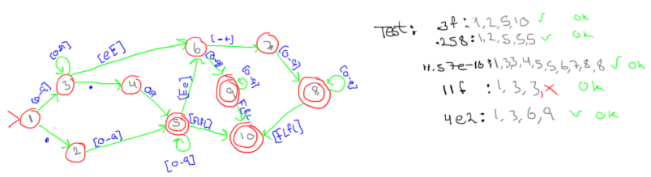

Problem set 1, Theory
=====================

Problem 1
---------
### _What version of gcc, flex and bison is installed on the server?_

* GCC: **4.6.3**
* Bison: **2.5**
* Flex: **2.5.35**

Problem 2
---------
### _What is the difference between an interpreter and a compiler?_

__Interpreter__:

 * No preprocessing
 * Limited optimization
 * Required to run the program
 * Good fit for "live" environment, aka a REPL

__Compiler__:

 * Lots of preprocessing (basically **only** preprocessing)
 * Lots of optimization
 * Not required to run the program

\pagebreak

Problem 3
---------

### A) Construct a nondeterministic finite automaton for the language `10*10(0|1)*0`

### B) Describe what kind of words the language includes

The NFA accepts binary strings that have the following properties:
An even binary number starting with a 1, optionally followed by any number of zeroes, containing at least one `10`, optionally followed by any binary string, finally ending in an additional 0. 

_I'm don't really recognise this pattern, so I'm not sure how to explain the words accepted by this NFA other than "translating" the RegEx into english_

	* Example 1 - shortest word:  1100;
	* Example 2 - longer word: 1000100
	* Example 3 - even longer word: 1100101010

### C) Create a transition table for the language, based on your automaton.

Node   0    1
----  ---  ---
 A     -    B
 B     B    C
 C     D    -
 D    {DEF} D
{DEF} {DEF} D

Problem 4
---------

_Note that the description does not allow for negative floats. Also, I have "cheated" by not having 9 edges between nodes where [0-9] is applicable._

