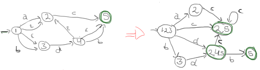

% Problem set 2
% Arve Nygård; Eirik Jakobsen
% 29.01.2013

Problem 1, Regular languages
----------------------------

### 1. a) __Convert the regular expression `a(b|c)d*e` to an NFA__


\pagebreak

### 1. b) __Convert the NFA in figure 1 to an equivalent DFA__


The following support tables were used during the "calculation"

|			| a |	b |	 c	|	d |	$\varepsilon$*|
|----:|:-:|:-:|:---:|:-:|:---------:|
|-> 1 |	2	|	3	|	 -	|	-	|	{1,2,3}		|
|   2	| -	| - |{2,5}| - |		 2			|
|   3	| -	| - | -		| 4 |		 3			|
|  (5)| -	| - | -		| - |		 5			|
|   4	| -	| 5 | -		| - | {2,4,5}		|

|					 | a$\varepsilon$* | b$\varepsilon$* | c$\varepsilon$* | d$\varepsilon$* |
|---------:|:---------------:|:---------------:|:---------------:|:---------------:|
|-> {1,2,3}|				2				 |				3				 |			{2,5}			 |			{2,4,5}		 |
|				 2 |				-				 |				-				 |			{2,5}			 |				 -			 |
|				 3 |				-				 |				-				 |				-				 |			{2,4,5}		 |
|		  (2,5)|				-				 |				-				 |			{2,5}			 |				 -			 |
|		(2,4,5)|				-				 |				5				 |			{2,5}			 |				 -			 |
|				(5)|				-				 |				-				 |				-				 |				 -			 |


\pagebreak

### 1. c) Flex program>
The problem is with nested curly braces. The following code would give a match, but would terminate early:

```c
while(something){
	if(something){
		//do stuff;
	}
}
```

This would remove everything up to the first closing brace, and leave the rest. To solve this we have to keep track of how many braces we have "opened".


Problem 2, Grammars
-------------------

### 2. a) What is an ambigious grammar?
An ambigiuos grammar is a grammar where there exists a string that has multiple leftmost derivations.

### 2. b)
Yes. The string mvmp can be derived in (at least) the following two ways:


### First way:  
**S** -> NvN  
**N**vN -> mvN  
mv**N** -> mvmp  

### Second way:  
**S** -> Sp  
**S**p -> NvNp  
**N**vNp -> mvNp  
mv**N**p -> mvmp  

### 2. c)
A left recursive grammar is a grammar that contains a non-terminal N with either immediate or indirect productions that begins with N again.
In other words: A grammar that contains a non-determinal that expands to itself (optionally through a chain of other non-terminals).


### 2. d)
Yes, because of the production `S -> Sp`.