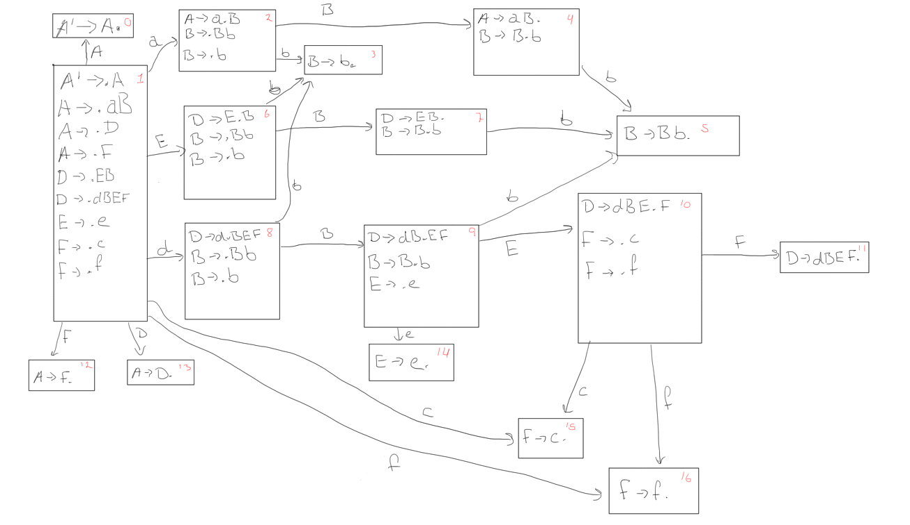

% Problem set 3 (Theory)
% Arve Nygård
% 10.02.2014


Problem 1: Parsing
==================

1. a) What is the difference between a top-down parser and a bottom-up parser?
------------------------------------------------------------------------------

A top-down parser builds the parse tree by starting at the root, and expanding nodes downward until it gets to the terminals.

A  bottom-up parser starts with the terminals, and constructs subtrees by connecting the current terminal with another terminal or another subtree, eventually ending at the root node. (shifting and reducing)


1. b) What is the difference between an LL-parser and LR parser?
----------------------------------------------------------------
Both parsers read input from left-to-right. LL-parsers are a type of top-down parser. It works by expanding the left-most derivation at all times.
A LR-parser is a bottom-up parser. It works by working on the right-most non-terminal at all times.

\pagebreak

Problem 2, Top-down parsing
===========================
A -> aB | D | F  
B -> bC  
C -> bC | $\varepsilon$  
D -> EB | dBEF  
E -> e | $\varepsilon$  
F -> c | f  


2. a) Tabulate the FIRST and FOLLOW sets for the grammar.
---------------------------------------------------------


|   |               FIRST               |    FOLLOW    |
|---+-----------------------------------+--------------|
| A | {a, b, c, d, e, f, $\varepsilon$} | { $ }        |
| B | {b}                               | {e, f, $ }   |
| C | {b, $\varepsilon$}                | {e, f, $ }   |
| D | {b, d, e, $\varepsilon$}          | { $ }        |
| E | {e, $\varepsilon$}                | {b, c, f}    |
| F |	{c, f}                            | { $ }        |

  : `FIRST` and `FOLLOW` sets


### First sets

FIRST(A): {a} + FIRST(D) + FIRST(F) = {a, b, c, d, e, f, $\varepsilon$}
  
FIRST(B): {b}  
  
FIRST(C): {b, $\varepsilon$}  
  
FIRST(D): FIRST(E) + {d} = {e} - {$\varepsilon$} + FIRST(B) + {d} = {b, d, e, $\varepsilon$}
  
FIRST(E): {e, $\varepsilon$}  
  
FIRST(F): {c, f}  

### Follow sets

FOLLOW(A): $  
  
FOLLOW(B): FOLLOW(D) + FOLLOW(A) + FIRST(E) + FIRST(F) = {e, f, $}
  
FOLLOW(C): FOLLOW(B) + FOLLOW(C) = {e, f, $}
  
FOLLOW(D): FOLLOW(A) = {$}
  
FOLLOW(E): FIRST(B) + FIRST(F) = {b, c, f}
  
FOLLOW(F): FOLLOW(A) + FOLLOW(D) = {$}

\pagebreak

2 b) Construct the predictive parsing table for the grammar.
------------------------------------------------------------


|   |      a      |      b      |      c      |      d      |      e      |      f      |      $      |
|---+-------------+-------------+-------------+-------------+-------------+-------------+-------------|
| A |     aB      |      D      |      F      |      D      |      D      |      F      |             |
| B |             |     bC      |             |             |             |             |             |
| C |             |     bC      |             |             |$\varepsilon$|$\varepsilon$|$\varepsilon$|
| D |             |     EB      |             |    dBEF     |     EB      |             |             |
| E |             |$\varepsilon$|$\varepsilon$|             |      e      |$\varepsilon$|             |
| F |             |             |      c      |             |             |      f      |             |
|   |             |             |             |             |             |             |             |

  : Prediction table


2 c) Show the moves a LR parser would make on input `dbbbf`.
------------------------------------------------------------


| Matched input | Stack | remaining input | action           | 
|---------------+-------+-----------------+------------------|
|      -        |  A$   |   dbbbf$    |  A->D            |
|      -        |  D$   |   dbbbf$    | D->dBEF          |
|      -        | dBEF$ |   dbbbf$    | accept           |
|      d        |  BEF$ |    bbbf$    | B->bC            |
|      d        | bCEF$ |    bbbf$    | accept           |
|     db        |  CEF$ |     bbf$    | C->bC            |
|     db        | bCEF$ |     bbf$    | accept           |
|    dbb        |  CEF$ |      bf$    | C->bC            |
|    dbb        | bCEF$ |      bf$    | accept           |
|   dbbb        |  CEF$ |       f$    | C->$\varepsilon$ |
|   dbbb        |   EF$ |       f$    | E->$\varepsilon$ |
|   dbbb        |    F$ |       f$    | F->f             |
|   dbbb        |    f$ |       f$    | accept           |
|  dbbbf        |     $ |        $    | accept           |
|  dbbbf\$      |     - |        $    | accept           |


\pagebreak

Problem 3: Bottom-up parsing
============================

```
A -> aB | D | F
B -> Bb | b
D -> EB | dBEF
E -> e
F -> c | f
```

3 a) Construct the LR(0) automaton for this grammar.
----------------------------------------------------



\pagebreak

3 b) Construct the SLR parsing table for this grammar.
----------------------------------------------------

### Rules:
0. A' -> A
1. A -> aB 
2. A ->  D
3. A ->  F
4. B ->  b
5. B -> Bb 
6. D -> EB
7. D -> dBEF
8. E -> e
9. F -> c
10. F -> f

### Follow sets
```
FOLLOW(A): {$}
FOLLOW(B): {b, e, $}
FOLLOW(D): {$}
FOLLOW(E): {b, c, f}
FOLLOW(F): {$}
```


|State| a  | b  | c  | d  | e  | f  |   $  | A  | B  | D  | E  | F	|
|-----+----+----+----+----+----+----+------+----+----+----+----+----|
|  1  | s2 |    |    | s8 |    |    |      | 0  |    | 13 |  6 | 12 | 
|  2  |    | s3 |    |    |    |    |      |    | 4  |    |    |    |
|  3  |    | r4 |    |    | r4 |    |  r4  |    |    |    |    |    |
|  4  |    | s5 |    |    |    |    |  r1  |    |    |    |    |    |
|  5  |    | r5 |    |    | r5 |    |  r5  |    |    |    |    |    |
|  6  |    | s3 |    |    |    |    |      |    | 7  |    |    |    |
|  7  |    | s5 |    |    |    |    |  r6  |    |    |    |    |    |
|  8  |    | s3 |    |    |    |    |      |    | 9  |    |    |    |
|  9  |    | s5 |    |    | s14|    |      |    |    |    | 10 |    |
| 10  |    |    | s15|    |    | s16|      |    |    |    |    | 11 |
| 11  |    |    |    |    |    |    |  r7  |    |    |    |    |    |
| 12  |    |    |    |    |    |    |  r3  |    |    |    |    |    |
| 13  |    |    |    |    |    |    |  r2  |    |    |    |    |    |
| 14  |    | r8 |    |    |    | r8 |      |    |    |    |    |    |
| 15  |    |    |    |    |    |    |  r9  |    |    |    |    |    |
| 16  |    |    |    |    |    |    |  r10 |    |    |    |    |    |
|  0  |    |    |    |    |    |    |ACCEPT|    |    |    |    |    |

  : Parse table. Action part is below terminals (lower case). GOTO-part is below non-terminals (uppercase) 

3 c) Show the moves a SLR parser would make on the input: `dbbbef`.
-------------------------------------------------------------------


|  Stack      | Symbols | Remaining input | Action     |
|------------:+:--------+----------------:+------------|
|            1|         |   dbbbef$       | shift (8)  |
|         1  8|   d     |    bbbef$       | shift (3)  |
|      1  8  3|   db    |     bbef$       | r4: B->b   |
|         1  8|   dB    |     bbef$       | GOTO 9     |
|      1  8  9|   dB    |     bbef$       | shift (5)  |
|   1  8  9  5|   dBb   |      bef$       | r5: B->Bb  |
|         1  8|   dB    |      bef$       | GOTO 9     |
|      1  8  9|   dB    |      bef$       | shift (5)  |
|   1  8  9  5|   dBb   |       ef$       | r5: B->Bb  |
|         1  8|   dB    |       ef$       | GOTO 9     |
|      1  8  9|   dB    |       ef$       | shift (14) |
|   1  8  9 14|   dBe   |        f$       | r8: E->e   |
|      1  8  9|   dBE   |        f$       | GOTO 10    |
|   1  8  9 10|   dBE   |        f$       | shift (16) |
|1  8  9 10 16|   dBEf  |         $       | r9: F->f   |
|   1  8  9 10|   dBEF  |         $       | GOTO(11)   |
|1  8  9 10 11|   dBEF  |         $       | r7: D->dBEF|
|            1|   D     |         $       | GOTO(13)   |
|         1 13|   D     |         $       | r2: A->D   |
|            1|   A     |         $       | GOTO(0)    |
|         1  0|   A     |         $       | ACCEPT.    |